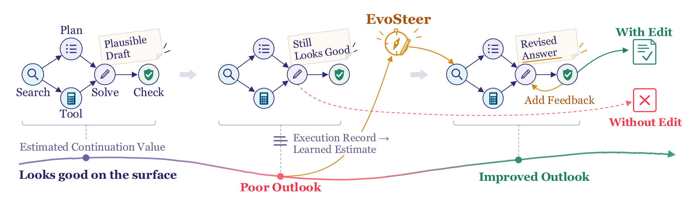
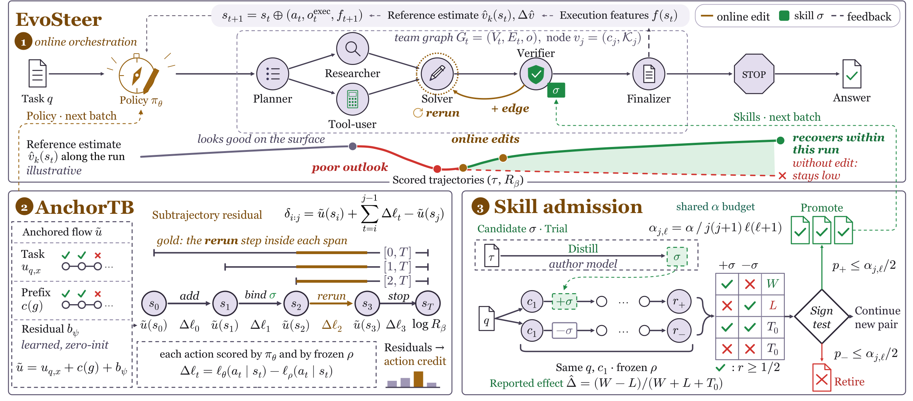

# EvoSteer: Online Self-Evolving Graph Orchestration via Reference-Anchored Credit Assignment

<div align="center">

[](https://huggingface.co/beita6969/EvoSteer-9b)
[](https://huggingface.co/datasets/beita6969/EvoSteer-Dataset)

### Repair the agent team while it runs, credit every edit, admit only validated skills



</div>

## Overview

EvoSteer trains an LLM **orchestrator** that builds and repairs a team of tool-using agents while the
team is running. Each action is executed the moment it is issued; the orchestrator then reads the
execution feedback, a 30-dimensional execution feature vector and a learned value estimate, and
decides the next edit. The repository implements the three components of the paper:

- **Online Self-Evolving Graph Orchestration**: interleaved build-and-execute on a typed agent
  communication graph. Repair (`RERUN_AGENT`, `DROP_AGENT`) shares one action space and one policy
  with construction.
- **Anchored Trajectory Balance (AnchorTB)**: a regression-style subtrajectory-balance loss relative to
  a frozen reference policy ρ, so that every action receives its own credit. Nonterminal flows combine
  a measured task-level anchor, a prefix-structure correction and a zero-initialized learned residual.
- **Validated Skill Admission**: an independent author model proposes candidate skills; each candidate
  is tried in paired counterfactual rollouts and promoted or retired by a sequential sign test under a
  shared α budget.

## Method

<div align="center">
  
</div>

### Online graph orchestration

A task is solved by a typed agent communication graph: each node is an agent with a role and bound
skills, each edge carries a communication protocol, and one node is the output. At every step the
orchestrator (Qwen3.5-9B + LoRA) chooses one atomic action; construction and repair share one action
space and one policy:

```text
construction: ADD_AGENT   ADD_EDGE   BIND_SKILL   SET_OUTPUT
repair:       RERUN_AGENT DROP_AGENT
terminal:     STOP
```

A legal-action mask follows from the graph, roles, skill slots and the shared budget. Every action is
applied and **executed at once** by a frozen executor (Qwen3.5-9B served by SGLang, thinking off). Its
feedback and a 30-dimensional execution feature vector are appended to the state; the features record
graph size, action type, repair outcome, whether agents answered and agree, communication, environment
phase and budget use, and need no extra model call. A two-layer value head on the features and the
task type estimates the reference continuation reward; the estimate and its one-step change are shown
to the orchestrator. In the released configuration the features and the estimate are also rendered as
a short textual diagnosis after every action, which describes and diagnoses but never prescribes an
action.

### Anchored Trajectory Balance

AnchorTB trains the orchestrator toward a reward-proportional target relative to the frozen reference
policy (the same backbone without the adapter). Each action's log-ratio to the reference is computed
on its executed tokens, and the balance residual of every subtrajectory is regressed toward zero, with
all subtrajectories weighted equally. Nonterminal flows combine a measured task-level anchor (a
leave-one-out shrinkage estimate of the reference success rate on the same task), a prefix-structure
correction, and a zero-initialized learned residual. Each action's gradient coefficient is the sum of
the residuals of all spans that contain it, so every edit receives its own credit.

### Validated Skill Admission

An independent author model distills at most one candidate skill per author window. For every batch
task of that family, two paired rollouts start from the same record and the same forced first role,
one binding the candidate and one not, and the reference policy continues both. The pairs accumulate
wins, losses and ties. At each validation round a sign test per direction is run under a shared
two-level alpha budget (α = 0.05): the candidate is promoted when the win test clears its boundary,
retired when the loss test does, and otherwise keeps accumulating pairs.

## Repository Layout

```text
src/skillev/evosteer_cli.py                 entry point: python -m skillev.evosteer_cli train
src/skillev/evosteer_application.py         rollouts, paired trials, updates, checkpoints
src/skillev/orchestration/                  graph runtime, legal actions, budget, tools, features, diagnosis
src/skillev/rollout/evosteer.py             one episode: decisions interleaved with execution
src/skillev/policy/                         orchestrator backbone (HF + PEFT), action scoring, value heads, prompts
src/skillev/scoring/anchor_tb.py            AnchorTB loss
src/skillev/training/                       updates, value fitting, reference statistics, task schedule
src/skillev/evolution/                      skill author, validated admission, paired trials
src/skillev/experiments/                    benchmark loaders and graders
configs/evosteer/evosteer_9b_paper.json     paper-aligned training configuration
configs/alfworld/base_config.yaml           ALFWorld text-environment configuration
scripts/evosteer/                           launchers (executor, retrieval, training) and dataset builders
data/evosteer/train/train_pool.jsonl        IID training pool (7,680 tasks)
data/evosteer/test/{iid,ood}/               IID and OOD test sets
figs/                                       figures from the paper
```

## Requirements

- Python 3.11+
- CUDA-capable GPUs: one for training (about 80 GB with asynchronous prefetch) and one or more for
  the SGLang executor replicas
- [SGLang](https://github.com/sgl-project/sglang) in a separate environment for the frozen executor
- An OpenAI Responses-compatible endpoint for the skill author

The paper experiments use Qwen3.5-9B as orchestrator, reference and executor, LoRA (rank 64, α 128)
in bfloat16, and DeepSeek-V4-Flash as the skill author.

## Installation

```bash
git clone <repository URL> evosteer
cd evosteer

pip install -e ".[policy,gpu,dev]"
pip install -e ".[alfworld]"
pip install -e ".[data]"      # only to rebuild the dataset files
```

Point `EVOSTEER_SGLANG_PY` to the interpreter of the SGLang environment.

Default locations are set in `scripts/evosteer/env.sh` (`EVOSTEER_MODELS`, `EVOSTEER_DATA`,
`EVOSTEER_RUNS`, …):

| Item | Default location |
| --- | --- |
| Qwen3.5-9B | `models/Qwen3.5-9B` |
| Retriever (e5-base-v2) | `models/e5-base-v2` |
| Retrieval corpus (Search-R1 / FlashRAG wiki-18, 21,015,324 passages) | `data/retrieval/wiki18`, prepared with `scripts/evosteer/serve_retrieval.sh prepare` |
| ALFWorld data | `data/alfworld`, prepared with `scripts/provision_alfworld_worker.sh` |

## Dataset

All training and test splits are included in `data/evosteer/`.

The paper evaluates 12 benchmarks: six IID benchmarks for training and testing, and six OOD benchmarks
for generalization only. Each OOD benchmark is posed as one IID task type.

```text
IID: HotpotQA, NQ-Open, MedQA, AIME 2026, MBPP+, ALFWorld
OOD: TriviaQA, MuSiQue, GPQA, MATH-Hard, SWE-Bench Verified, WebShop
```

| Benchmark | Role | Training | Test | Test source | Metric |
| --- | --- | --- | --- | --- | --- |
| HotpotQA | IID | 1,280 from distractor *train* | 128 | distractor *validation* | Ans EM |
| NQ-Open | IID | 1,280 from *train* | 128 | *validation* | Ans EM |
| MedQA (USMLE, 4 options) | IID | 1,280 from *train* | 128 | *test* | Acc. |
| AIME | IID | 1,280 (977 problems, AIME 1983–2025) | 30 | AIME 2026, all problems | Acc. |
| MBPP+ | IID | 1,280 (247 problems) | 128 | 128 of the 378 problems | Pass@1 |
| ALFWorld | IID | 1,280 games from *train* | 128 | *valid_unseen* | SR (≤ 50 steps) |
| TriviaQA | OOD | – | 128 | rc.nocontext *validation* | Ans EM |
| MuSiQue | OOD | – | 128 | MuSiQue-Ans v1.0 *dev* | Ans EM |
| GPQA | OOD | – | 128 | Diamond (IDs only) | Acc. |
| MATH-Hard | OOD | – | 128 | MATH *test*, level 5 | Acc. |
| SWE-Bench Verified | OOD | – | 128 | 128 of the 500 instances | Resolved |
| WebShop | OOD | – | 128 | official human-goal test range | SR |

The training recipe uses 240 steps of 32 tasks, so the pool has 7,680 tasks, 1,280 per IID benchmark.
Each benchmark's candidates are ranked by `sha256("train:<task type>:<source id>")` and the first 1,280
are kept; AIME (977 problems) and MBPP+ (247 problems) are cycled in the same order, and repeated copies
carry the task id suffix `~r<k>`. Training tasks are disjoint from every test set: items whose question
matches a test item of the same task type are removed, as are the MBPP+ problems whose statement matches
an IID test problem up to numbers (MBPP 71 and 762) and the three AIME problems that reappear in
MATH-Hard. Each test set holds the first 128 candidates by `sha256("test:<benchmark>:<source id>")`
(AIME 2026: all 30). There is no separate validation split.

GPQA questions are not redistributed: `data/evosteer/test/ood/gpqa_diamond.ids.json` lists the Record
IDs and option-order seeds. Accept the terms of `Idavidrein/gpqa`, download `gpqa_diamond.csv`, and run
`python scripts/evosteer/build_ood_text_test.py gpqa <gpqa_diamond.csv> data/evosteer/test/ood/gpqa_diamond.ids.json <out.jsonl>`.

All files can be rebuilt from pinned public sources; every builder checks the sha256 of its inputs.
Build the test sets first, since `build_train_pool.py` excludes overlaps with them and rewrites
`sampling.task_sources` of the training configuration:

```bash
python scripts/evosteer/build_iid_test.py --raw <raw dir> --alfworld-data data/alfworld
python scripts/evosteer/build_ood_text_test.py text <raw dir> data/evosteer/test/ood
python scripts/evosteer/build_ood_env_test.py --raw <raw dir>
python scripts/evosteer/build_train_pool.py --raw <raw dir> --alfworld-data data/alfworld \
  --config configs/evosteer/evosteer_9b_paper.json
```

## Configure Skill Author

The author is an independent model reached through an OpenAI Responses-compatible API and is called
only in author windows. It is not fixed in this repository:

```bash
export EVOSTEER_AUTHOR_API_BASE=<base URL of a Responses-compatible endpoint>
export EVOSTEER_AUTHOR_API_KEY_FILE=<file containing the API key>
export EVOSTEER_AUTHOR_API_MODEL=<author model name>
export EVOSTEER_AUTHOR_API_EFFORT=high
```

`train.sh` refuses to start until the first three are set.

## Start Executor and Retrieval Services

```bash
EVOSTEER_EXECUTOR_GPU=1 EVOSTEER_EXECUTOR_PORT=31000 scripts/evosteer/serve_executor.sh start
EVOSTEER_EXECUTOR_GPU=2 EVOSTEER_EXECUTOR_PORT=31001 scripts/evosteer/serve_executor.sh start
export EVOSTEER_EXECUTOR_URL=http://127.0.0.1:31000,http://127.0.0.1:31001

scripts/evosteer/serve_retrieval.sh start
```

## Training

```bash
EVOSTEER_TRAIN_GPU=0 scripts/evosteer/train.sh
```

Resume from a checkpoint directory:

```bash
EVOSTEER_TRAIN_GPU=0 scripts/evosteer/train.sh runs/evosteer_<stamp>/checkpoints/batch-000120
```

Before starting, `train.sh` checks that every executor replica and the retrieval service are healthy,
and that a sandboxed python-tool program cannot read the task file. `EVOSTEER_PIPELINE=1` (default) is
the asynchronous prefetch of the paper; `EVOSTEER_PIPELINE=0` collects a batch and then updates, with
less memory. Other variables: `EVOSTEER_CONFIG`, `EVOSTEER_CURVE_DATA`, `EVOSTEER_ROLLOUT_CONCURRENCY`.

Important paper-aligned defaults are already set in `configs/evosteer/evosteer_9b_paper.json`:

| Category | Setting |
| --- | --- |
| Backbones | Qwen3.5-9B orchestrator, reference and executor; external skill author (DeepSeek-V4-Flash in the paper) |
| LoRA | rank 64, alpha 128, on q/k/v/o_proj, out_proj and in_proj_qkv |
| Optimizer | AdamW (β1 = 0.95), lr 5e-6; heads lr 1e-3, weight decay 0.01, gradient clip 1.0 |
| AnchorTB | β = 2, all subtrajectories equally weighted |
| Batch | 240 steps × 32 tasks; 2θ + 2ρ rollouts per task plus paired rollouts (192 episodes per step); asynchronous prefetch |
| Task sampling | source-balanced, without replacement; each pool task is used once |
| Skill admission | sequential sign test at every validation round, α = 0.05 with two-level alpha spending; ≤ 3 validated skills and 1 candidate per task type; library ≤ 60, ≤ 12 per family |
| Budget | 98,304 tokens, 50 tool calls and 600 s per episode |
| Temperatures | orchestrator 1.0, executor 0.3 |
| ALFWorld | 25 environment steps per node, 50 per episode |

Each run directory holds `metrics.jsonl` (one row per step), `trajectories/batch-*.jsonl` and
`checkpoints/batch-*`.

## Model Weights

The trained orchestrator is released as a complete model, with the LoRA adapter merged into
Qwen3.5-9B:

```text
https://huggingface.co/beita6969/EvoSteer-9b
```

The merged layers are stored in float32; load the model in float32 to reproduce the trained
orchestrator exactly:

```python
import torch
from transformers import AutoTokenizer, Qwen3_5ForConditionalGeneration

model = Qwen3_5ForConditionalGeneration.from_pretrained("beita6969/EvoSteer-9b", dtype=torch.float32)
tokenizer = AutoTokenizer.from_pretrained("beita6969/EvoSteer-9b")
```

## License

This repository is released for research use. Please also follow the licenses and terms of the upstream
models, datasets, and benchmark suites used with EvoSteer.
